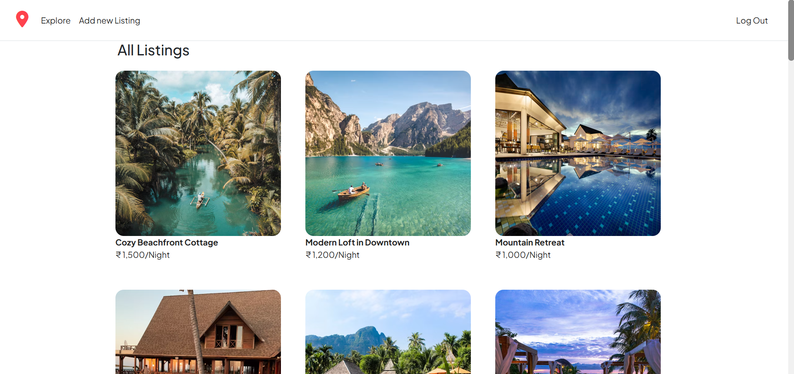

<h1 align="center">
  <span style="padding: 0.2em 0.6em; border-radius: 6px;">
    Easy Bookings
  </span>
</h1> 

Easy Bookings is a full-stack web application that allows users to list, manage, and book rental properties. It supports user authentication, role-based access, and features like reviews, dashboards, and secure data handling. Built with Node.js, Express, MongoDB, and EJS, the app provides a smooth and secure booking experience.

---

## 🚀 Live Demo
https://major-project-vx5g.onrender.com/listing

---

## 🔍 Features

- 🏘️ List and manage properties with images and descriptions  
- 🔐 Secure authentication using sessions  
- 📝 Post, edit, and delete reviews on properties  
- 🧑‍💼 Role-based access: only property owners can modify their listings  

---

## 📄 Pages Description

### 1. **Properties Listing Page**
- Shows all properties with filters
- Click on a property to view details

<p align="center">
  
</p>

---

### 2. **Authentication (Register / Login)**
- Secure login and registration
- Session-based user authentication

<p align="center">
  
</p>

<p align="center">
  
</p>

---

### 4. **Property Details Page**
- Detailed information, images, and reviews
- Option to book, review, or contact host

<p align="center">
  
</p>
<p align="center">
  
</p>


---

### 5. **Add / Edit Property**
- Only logged-in users can add properties
- Owners can edit or delete their listings

<p align="center">
  
</p>

---

## 🛠️ Installation Instructions

### 1. Clone the repository

```bash
git clone https://github.com/KarthikeyaTadiparti/Easy-Bookings.git
cd Easy-Bookings
```
### 2. Install dependencies
```bash
npm install
```
### 3. Set up environment variables
Create a .env file in the root directory and add:
```bash
PORT=3000
MONGO_URI=your_mongodb_connection_string
SESSION_SECRET=your_secret
```
### 4. Run the application
```bash
npm start
```
Open http://localhost:3000 in your browser.
